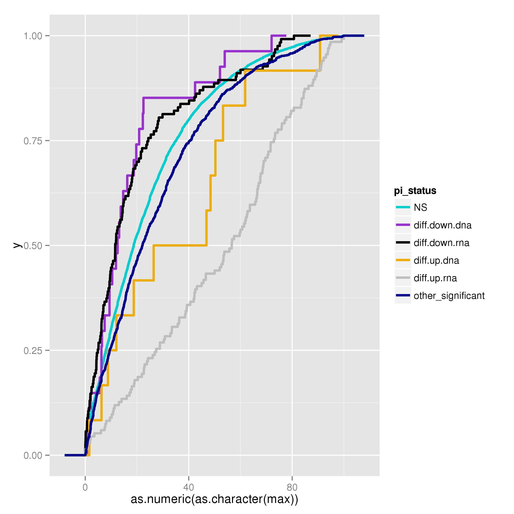
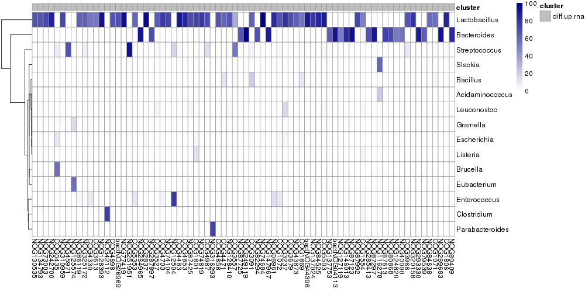

===========================
Assigning NOGs to genera
===========================

We were interested in defining which genera were responsible for the expression of differentially
abundant NOGs. Since we have read assignments to genera and NOGs, all we had to do was to select
reads that were aligned to both and count the number of reads per genus-NOG pair. For each sample
we take the RNA-seq read assignments and do the counting. By default the following script will output
the percentage of reads from each genus that map to a NOG. This is the basic input for the generation
of Fig. 3a. The script takes as input a gene2cog mapping file (-m), the list of NOGs
which we wish to calculate % genus reads over (-d), the level at which to count (--level),
the taxa assignments file and the alignment to the IGC::

    $ python <path_to_proj029>/proj029/scripts/nogs2genera.py
             -m gene2cog.tsv.gz
             -d common_genes.tsv
             --level=genus
             --alignment-taxa=stool-HhaIL10R-R1.lca
             --alignment-genes=stool-HhaIL10R-R1.igc.tsv.gz                    
             --log=stool-HhaIL10R-R1.diamond.ptaxa.tsv.gz.log
             | gzip > associate_taxa.dir/stool-HhaIL10R-R1.diamond.ptaxa.tsv.gz

Once we have a .ptaxa.tsv.gz file for each sample, we combine the tables using combine_tables.py. This proces is somewhat
time-consuming and uses a lot of memory. We have therefore provided the .ptaxa.tsv.gz combined files in the data/RNA/directory.
The file is called associated_ptaxa.tsv.gz. You can link this file to your RNA/ working directory::

    $ cd <path_to_RNA>/RNA
    $ ln -s <path_to_data>/data/RNA/associated_ptaxa.tsv.gz .

It will look like this (truncated for visual purposes):

    +---------+---------------+------------------------+----------------------+----------------------+------------------+------------------+
    |cog      |taxa           |stool-HhaIL10R-R2_preads|stool-aIL10R-R3_preads|stool-aIL10R-R2_preads|stool-WT-R4_preads|stool-WT-R1_preads|
    +=========+===============+========================+======================+======================+==================+==================+
    |NOG243842|unassigned     |100.000000              |100.000000            |0                     |0                 |0                 |
    +---------+---------------+------------------------+----------------------+----------------------+------------------+------------------+
    |NOG243840|unassigned     |50.000000               |0                     |50.000000             |100.000000        |100.000000        |
    +---------+---------------+------------------------+----------------------+----------------------+------------------+------------------+
    |NOG243840|Clostridium    |50.000000               |0                     |0                     |0                 |0                 |
    +---------+---------------+------------------------+----------------------+----------------------+------------------+------------------+
    |NOG281778|unassigned     |100.000000              |0.000000              |0.000000              |50.000000         |66.666667         |
    +---------+---------------+------------------------+----------------------+----------------------+------------------+------------------+
    |NOG41625 |unassigned     |33.510638               |46.000000             |40.909091             |48.762376         |48.958333         |
    +---------+---------------+------------------------+----------------------+----------------------+------------------+------------------+
    |NOG41625 |Parabacteroides|2.393617                |1.000000              |0                     |1.485149          |3.125000          |
    +---------+---------------+------------------------+----------------------+----------------------+------------------+------------------+
    |NOG41625 |Bacteroides    |48.670213               |29.000000             |31.818182             |22.772277         |23.958333         |
    +---------+---------------+------------------------+----------------------+----------------------+------------------+------------------+
    |NOG41625 |Porphyromonas  |11.436170               |19.000000             |18.181818             |19.554455         |9.375000          |
    +---------+---------------+------------------------+----------------------+----------------------+------------------+------------------+
    |NOG41625 |Flavobacterium |0.265957                |0                     |1.515152              |0.247525          |2.083333          |
    +---------+---------------+------------------------+----------------------+----------------------+------------------+------------------+

Where a read has a NOG assignment but not a genus assignment it contributes to the percentage of reads annotated as unassigned.

Build the NOG genus counts matrix
==================================

We needed to transform this data into average percentages across samples for each NOG-genus combination. To do this we use the following
function. In the RNA/ directory::

    >> import Proj029Pipelines.PipelineMetaomics as PipelineMetaomics
    >> PipelineMetaomics.buildGenusCogCountsMatrix("associated_ptaxa.tsv.gz", "associated_ptaxa_average.matrix")

This will give us this file:

    +---------------+-----------+-------------------+-------+------------+-------+------------+------------+------------+--------------------+
    |               |COG0001    |COG0002            |COG0003|COG0004     |COG0005|COG0006     |COG0007     |COG0008     |COG0009             |
    +===============+===========+===================+=======+============+=======+============+============+============+====================+
    |Abiotrophia    |0          |0                  |0      |0           |0      |0           |0           |0           |0                   |
    +---------------+-----------+-------------------+-------+------------+-------+------------+------------+------------+--------------------+
    |Acaryochloris  |0.002159625|0                  |0      |0.0186110625|0      |0.009047375 |0           |0           |0.0021784375        |
    +---------------+-----------+-------------------+-------+------------+-------+------------+------------+------------+--------------------+
    |Acetivibrio    |0          |0                  |0      |0           |0      |0           |0           |0           |0                   |
    +---------------+-----------+-------------------+-------+------------+-------+------------+------------+------------+--------------------+
    |Acetobacter    |0          |0.003267125        |0      |0           |0      |0.0112120625|0           |0.0004040625|0.011865875000000001|
    +---------------+-----------+-------------------+-------+------------+-------+------------+------------+------------+--------------------+
    |Acetobacterium |0          |0                  |0      |0           |0      |0           |0           |0           |0                   |
    +---------------+-----------+-------------------+-------+------------+-------+------------+------------+------------+--------------------+
    |Acholeplasma   |0          |0                  |0      |0           |0      |0           |0           |0.0198231875|0.003799375         |
    +---------------+-----------+-------------------+-------+------------+-------+------------+------------+------------+--------------------+
    |Achromobacter  |0          |0                  |0      |0           |0      |0           |0           |0           |0                   |
    +---------------+-----------+-------------------+-------+------------+-------+------------+------------+------------+--------------------+
    |Acidaminococcus|0          |0.17178093749999998|0      |0           |0      |0.056347    |0.2652984375|0.005379875 |0.10410106250000001 |
    +---------------+-----------+-------------------+-------+------------+-------+------------+------------+------------+--------------------+
    |Acidianus      |0          |0                  |0      |0           |0      |0           |0           |0           |0                   |
    +---------------+-----------+-------------------+-------+------------+-------+------------+------------+------------+--------------------+

We can use this data and our previously described NOG annotations to assess the maximum percentage that any genus contributes to the expression
of a NOG

Plotting the maximum contribution of a genus to NOG expression
===============================================================

We can recreate Fig. 3a by running::

    >> PipelineMetaomics.plotMaxTaxaContribution("associated_ptaxa_average.matrix",
                                                 "<path_to_compare_datasets>/compare_datasets/rna_dna_ratio.annotated.outsidepi.tsv",
                                                 "associated_ptaxa_max_contribution.png")

The cumulative proportion plot shows us that the NOGs annotated as being up-regulated and colitis-responsive are more likely
to be expressed by a dominant genus than the other NOG sets.

Plotting dominant genera for colitis-responsive NOGs
====================================================

To see which genera are dominating the expression of these NOGs we use the following function::

    >> PipelineMetaomics.heatmapTaxaCogProportionMatrix("associated_ptaxa_average.matrix",
                                                        "<path_to_compare_datasets>/compare_datasets/rna_dna_ratio.annotated.outsidepi.tsv",
                                                        "associated_ptaxa_heatmap.pdf")

This will produce the plot below, representing genera that contribute >=10% to NOG expression of up-regulated, colitis-
responsive NOGs that have a dominant genus (>=50% maximum genus contribution).

