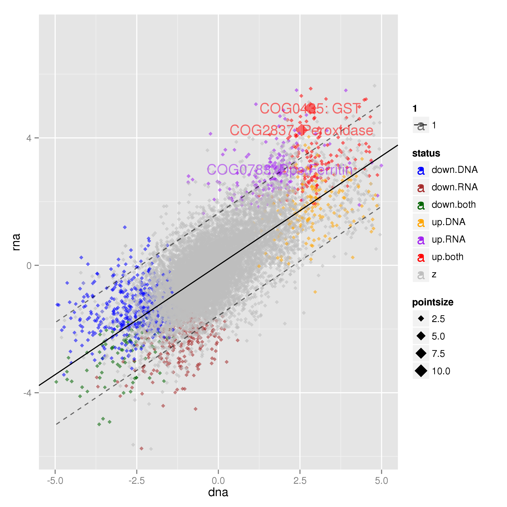

================================
Defining colitis-dependent NOGs
================================

In the compare_datasets/ directory create a link to the goi.tsv file in the data/ directory. This will become clearer in a little while::

    $ ln -s ../data/goi.tsv .

Out metagenomeSeq analysis was performed on NOGs and we identified 1221 and 669 NOGs to be differentially abundant in 
metagenomic and metatranscriptomic data sets, respectively. The overlap between these sets suggested that there were 
some NOGs that were transcriptionally activated in colitis, leading us to hypothesise that these were due to responses
by bacteria to an alteration in the gut niche.

A few tasks were performed before we produced Fig. 2g - some of which did not end up in the manuscript. For example we
built the RNA fold / DNA fold ratio for NOGs using the metagenomeSeq differential abundance files. In the compare_datasets
directory do::

    >> import Proj029Pipelines.PipelineMetaomics as PipelineMetaomics
    >> PipelineMetaomics.buildRNADNARatio("../DNA/gene_counts.diff.tsv",
                                          "../RNA/gene_counts.diff.tsv",
                                          "rna_dna_ratio.tsv") 

then we build the differentially abundant NOGs list from database (Hh + aIL10R vs. Steady state) for each of DNA and RNa
 data sets::

    >> PipelineMetaomics.buildGeneDiffList("../RNA/csvdb",
                                           "common_genes.tsv",
                                           "rna_diff_genes.tsv")

    >> PipelineMetaomics.buildGeneDiffList("../DNA/csvdb",
                                           "common_genes.tsv",
                                           "dna_diff_genes.tsv")

and just before plotting we annotate NOGs with their differential abundance status i.e
in DNA, RNA or both data sets::

    >> PipelineMetaomics.annotateRNADNARatio("rna_dna_ratio.tsv",
                                             "dna_diff_genes.tsv",
                                             "rna_diff_genes.tsv",
                                             "rna_dna_ratio.annotated.tsv")

We then plot the DNA and RNA fold changes, fit a linear model and plot the 95% prediction intervals. There is 
a little bit of sneakyness here as before we created the final plot we found NOGs of interest. This function
picks up a file called goi.tsv that contains annotations for the plot. These annotations are for NOGs that
are annotated as being involved in oxidative stress resistance and are up-regulated in metatranscriptomic
data and defined as colitis-responsive (lying outside of the 95% prediction interval for the model fit)::

    >> PipelineMetaomics.plotSets("rna_dna_ratio.annotated.tsv",
                                  "rna_dna_ratio.annotated.png")

This will produce Fig.2g.

We were interested predominantly in those NOGs that were defined as colitis responsive. We therefore annotated them
as such - defined as being outside of the 95% prediction interval::

    >> PipelineMetaomics.buildGenesOutsidePredictionInterval("rna_dna_ratio.annotated.tsv", "rna_dna_ratio.annotated.outsidepi.tsv")

This produces the following file with a column describing the status of each NOG (pi_status) that determines whether or not it falls
outside of the 95% prediction interval and in which direction

    +---------+--------------+--------------+-------------------+--------------------+-----------------+--------+-------------------+-----------------+-------------+
    |gene     |dna           |rna           |pdna               |prna                |ratio            |status  |lwr                |upr              |pi_status    |
    +=========+==============+==============+===================+====================+=================+========+===================+=================+=============+
    |NOG318244|-1.03311983427|-3.88099075439|0.227566146514034  |0.000732213528700738|-2.84787092012783|down.RNA|-2.29189879455845  |0.924539008671926|diff.down.rna|
    +---------+--------------+--------------+-------------------+--------------------+-----------------+--------+-------------------+-----------------+-------------+
    |NOG130535|1.57674408446 |4.10185194239 |0.0489497441044796 |0.000732213528700738|2.52510785792768 |up.both |-0.500617727281953 |2.71597876719476 |diff.up.rna  |
    +---------+--------------+--------------+-------------------+--------------------+-----------------+--------+-------------------+-----------------+-------------+
    |NOG134793|2.23869128315 |4.54943410575 |0.0328705226009625 |0.000732707448196766|2.31074282259625 |up.both |-0.0463574163834217|3.17041411560104 |diff.up.rna  |
    +---------+--------------+--------------+-------------------+--------------------+-----------------+--------+-------------------+-----------------+-------------+
    |NOG288530|4.52461981525 |5.2148699462  |0.00435113290891389|0.000732707448196766|0.69025013094869 |up.both |1.52214814358271   |4.73994333954382 |diff.up.rna  |
    +---------+--------------+--------------+-------------------+--------------------+-----------------+--------+-------------------+-----------------+-------------+
    |NOG73003 |2.93026599661 |4.60138832113 |0.0171404768468839 |0.000798074756693038|1.67112232452162 |up.both |0.428205612895006  |3.64521825858309 |diff.up.rna  |
    +---------+--------------+--------------+-------------------+--------------------+-----------------+--------+-------------------+-----------------+-------------+
    |NOG242700|2.70090741616 |4.5185334849  |0.0291946059040304 |0.000798074756693038|1.81762606873595 |up.both |0.270821573253439  |3.48774765892459 |diff.up.rna  |
    +---------+--------------+--------------+-------------------+--------------------+-----------------+--------+-------------------+-----------------+-------------+
    |COG0418  |7.40633864052 |4.87181180102 |0.00161195783102831|0.000801401399329138|-2.53452683949718|up.both |3.4989965428968    |6.71900772759713 |NA           |
    +---------+--------------+--------------+-------------------+--------------------+-----------------+--------+-------------------+-----------------+-------------+
    |COG0435  |2.81674412896 |4.933419462   |0.0292484323181148 |0.000801401399329138|2.11667533304774 |up.both |0.350308216294483  |3.56727720073607 |diff.up.rna  |
    +---------+--------------+--------------+-------------------+--------------------+-----------------+--------+-------------------+-----------------+-------------+
    |NOG310959|2.94747733379 |4.63709916181 |0.0234651617179669 |0.00113572329548064 |1.68962182801844 |up.both |0.440015764023919  |3.6570351692761  |diff.up.rna  |
    +---------+--------------+--------------+-------------------+--------------------+-----------------+--------+-------------------+-----------------+-------------+

And that is Fig. 2 done!

