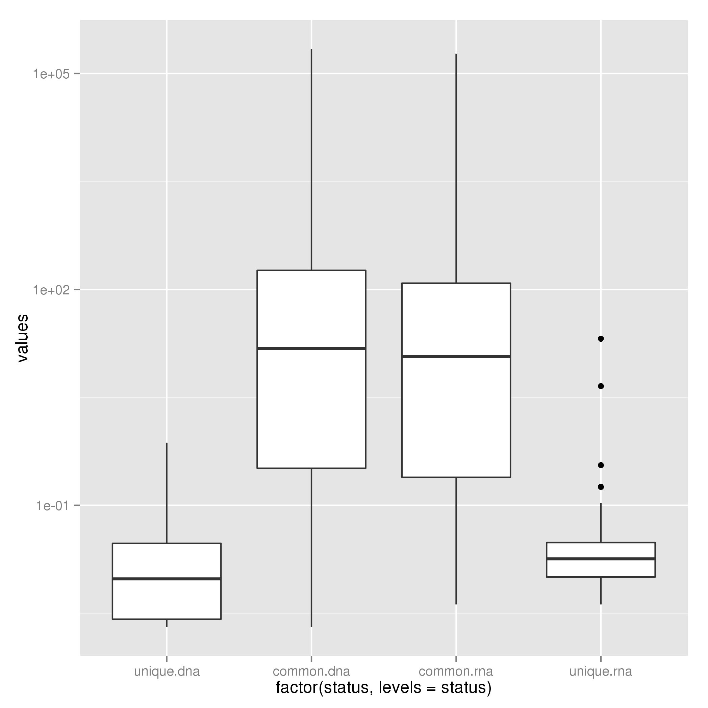
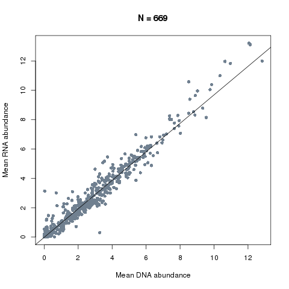

=======================================================
Comparing metagenomic and metatranscriptomic data sets
=======================================================

There is very little metatranscriptomic data out there in colitis. Therefore we were initially just
interested in comparing metagenomic and metatranscriptomic data sets in terms of the genera and 
functions that are detected and the correlation of abundance estimates. The following describes how
we performed these analyses.

First we make a separate working directory for the comparison::

    $ mkdir compare_datasets
    $ cd compare_datasets

The first analysis that we do is to do some simple comparisons between the DNA and RNA data sets (Fig. 1 in the paper). 
This involves looking at the number of genera/NOGs that were detected in each method (and the overlap) and how abundance
as measured by DNA compares with abundance of RNA. Here we will use the PipelineMetaomics.py module
to look at the overlaps. The function takes as positional arguments the RNA counts, DNA counts and outfile name. For example,
for genera we can type::

    >> import Proj029Pipelines.PipelineMetaomics as PipelineMetaomics
    >> PipelineMetaomics.buildDetectionOverlap("../RNA/genus.diamond.aggregated.counts.tsv.gz", 
                                               "../DNA/genus.diamond.aggregated.counts.tsv.gz", 
                                               "genus_overlap.tsv")

This will produce an outfile named genus_overlap.tsv that contains the number of genera detected with > 1 read in >= 1 
sample in DNA and RNA analyses as well as the overlap. We run this also for the NOG count tables. 

We then compared the feature abundance distributions (e.g. genera) that were detected in DNA, RNA or both data sets (based on reads 
per million (RPM) values from counts tables). To do this we run the following functions againg with RNA counts, DNA coutns and outfile
as positional arguments::

    >> PipelineMetaomics.plotAbundanceLevelsOfOverlap("../RNA/genus.diamond.aggregated.counts.tsv.gz",
                                                      "../DNA/genus.diamond.aggregated.counts.tsv.gz",
                                                      "genus_abundance_distributions.png")

This produces the following plot in the file genus_abundance_distributions.png.

This function also produces the file "genus_abundance_distributions.sig" which contains the significance of the differences
between sets of features based on the wilkoxon rank sum test. 

We can then compare abundance estimates for those commonly detected genera (or NOGs) based on metagenomeSeq normalised
abundances.:: 
 

    >> PipelineMetaomics.scatterplotAbundanceEstimates("../DNA/genus.diamond.aggregated.counts.norm.matrix",
                                                       "../RNA/genus.diamond.aggregated.counts.norm.matrix",
                                                       "genus_abundance_correlation.png")

This produces the plot below in the file genus_abundance_correlation.png and prints out our correlation coefficient of 0.98.

This was repeated using the same functions for NOG-based counts and normalised counts (Fig. 2). And that is a general 
comparison between data sets completed.

