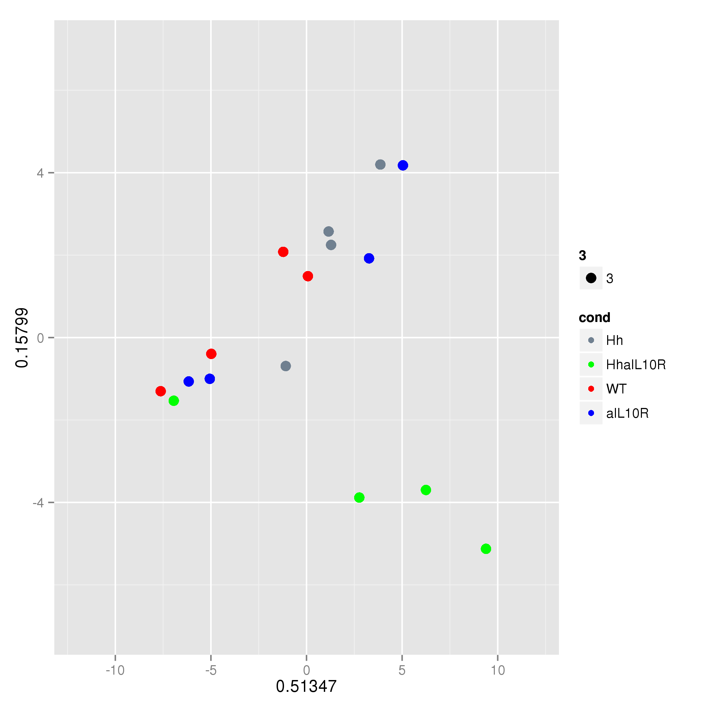

==============================
Principle components analysis
==============================

We performed principle components analysis on metagenomeSeq normalised counts at the level of genus
and NOG (metagenomics and metatranscriptomics, see Fig. 2d, e and f and Fig. 4d and e).
As this is done separately for each data set we return to the DNA/ and RNA/ directories we created to run the functions. 
Below we show the functions we ran to produce the figures and to test significance of sample clustering using the PERMANOVA 
implemented in the adonis test (vegan).

To begin with we look at genus abundances. Below is a representative example for the RNA analysis. This function
produces the PCA plot (genus.diamond.aggregated.counts.pca.png) for components 1 and 2 and also outputs the loadings. 
The name of the plot is consistent with the name of the loadings outfile (apologies but the outfile must end in .loadings.tsv). You must be in 
the directory where you want the files to be produced, otherwise there will be an error. In the RNA/ directory type::

    >> import Proj029Pipelines.PipelineMetaomics as PipelineMetaomics
    >> PipelineMetaomics.runPCA("genus.diamond.aggregated.counts.norm.matrix", "genus.diamond.aggregated.counts.loadings.tsv")

This produces the following plot.

The adonis test in the module PipelineMetagenomeCommunities.py from `CGATPipelines`_ was run to test for significant clustering of conditions::

    >> import CGATPipelines.PipelineMetagenomeCommunities as PipelineMetagenomeCommunities
    >> PipelineMetagenomeCommunities.testDistSignificance("genus.diamond.aggregated.counts.norm.matrix", "genus.diamond.aggregated.counts.norm.permanova.sig")

The file "genus.diamond.aggregated.counts.norm.permanova.sig" contains the model fit and significance p-value.

 
.. _CGATPipelines: https://github.com/CGATOxford/CGATPipelines

